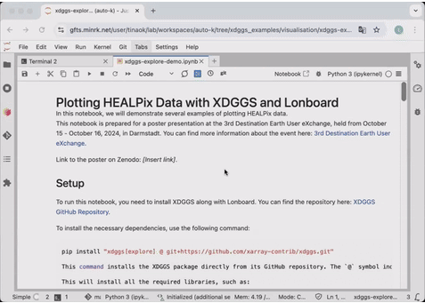

# xdggs

`xdggs` is an extension for [Xarray](https://xarray.pydata.org/) that provides tools to handle geospatial data using Discrete Global Grid Systems (DGGS). It allows efficient manipulation and analysis of multi-dimensional gridded data within a DGGS framework, facilitating spatial data processing, resampling, and aggregations on both global and regional scales.

## Key Features

- **Seamless Integration with Xarray**: Use `xdggs` alongside Xarray's powerful tools for managing labeled, multi-dimensional data.
- **Support for DGGS**: Convert geospatial data into DGGS representations, allowing for uniform spatial partitioning of the Earth's surface.
- **Spatial Resampling**: Resample data on DGGS grids, enabling downscaling or upscaling across multiple resolutions.
- **DGGS Aggregation**: Perform spatial aggregation of data on DGGS cells.
- **Efficient Data Management**: Manage large datasets with Xarray's lazy loading, Dask integration, and chunking to optimize performance.

## Installation

To install `xdggs`, you can clone the repository and install it using pip:

```bash
git clone https://github.com/xarray-contrib/xdggs.git
cd xdggs
pip install .
```

Alternatively, you can install it directly via pip (once it's available on PyPI):

```bash
pip install xdggs
```

## Demo



## Getting Started

As an example, this is how you would use `xdggs` to reconstruct geographical coordinates from the cell ids then create an interactive plot indicating cell ids, data values and the associated geographical coordinates:

```python
import xarray as xr
import xdggs

# Load the dataset created by ./examples/prepare_dataset_h3.ipynb
ds = xr.open_dataset("data/h3.nc", engine="netcdf4")

# Decode DGGS coordinates
ds_idx = ds.pipe(xdggs.decode)

# Assign geographical coordinates
ds_idx = ds_idx.dggs.assign_latlon_coords()

# Interactive visualization
ds_idx['air'].isel(time=0).compute().dggs.explore(center=0, cmap="viridis", alpha=0.5)

```

## Dependencies

- Python >= 3.10
- Xarray >= 2023.09.0
- NumPy >= 1.24.0
- Dask >= 2023.10.0 (optional, for parallel computing)

## Documentation

You can find additional examples in [https://github.com/xarray-contrib/xdggs/tree/main/examples](https://github.com/xarray-contrib/xdggs/tree/main/examples).

## Roadmap

We have exciting plans to expand xdggs with new features and improvements. You can check out our roadmap in the [design_doc.md](design_doc.md) file for details on the design of xdggs, upcoming features, and future enhancements.

## Contributing

We welcome contributions to `xdggs`! Please follow these steps to get involved:

1. Fork the repository.
2. Create a new branch (`git checkout -b feature-branch`).
3. Make your changes and write tests.
4. Ensure all tests pass (`pytest`).
5. Submit a pull request!

## License

`xdggs` is licensed under the Apache License License. See [LICENSE](LICENSE) for more details.

## Acknowledgments

This project was inspired by the increasing need for scalable geospatial data analysis using DGGS and is built upon the robust ecosystem of Xarray.
